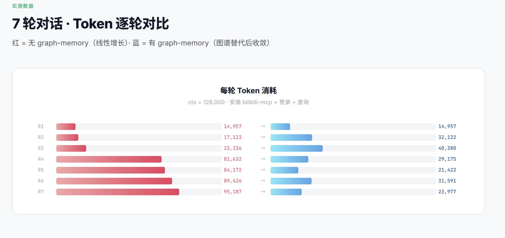

<p align="center">
  
</p>

<h1 align="center">graph-memory</h1>

<p align="center">
  <strong>OpenClaw 知识图谱上下文引擎插件</strong><br>
  作者 <a href="mailto:Wywelljob@gmail.com">adoresever</a> · MIT 许可证
</p>

<p align="center">
  <a href="#安装">安装</a> ·
  <a href="#工作原理">工作原理</a> ·
  <a href="#配置参数">配置</a> ·
  <a href="README.md">English</a>
</p>

---

<p align="center">
  
</p>

## 记忆、Skills、Agent——难道不是一个东西吗？

大道至简——其实都是**上下文工程**。但现在有三个致命问题：

🔴 **上下文爆炸** — Agent 执行任务反复试错，pip 日志、git 输出、报错堆栈疯狂堆积。174 条消息吃掉 95K token，噪音远大于信号，且无法祛除。

🔴 **跨对话失忆** — 昨天踩过的坑、解过的 bug，新对话全部归零。MEMORY.md 全量加载？单次召回成本 49 万 token。不加载？同样的错误来一遍。

🔴 **技能孤岛** — self-improving-agent 记录的学习条目是孤立的 markdown 列表，没有因果关系、没有依赖链、没有知识体系。"装了 libgl1" 和 "ImportError: libGL.so.1" 之间毫无关联。

**graph-memory 用一个方案同时解决这三个问题。**

## 实测数据

<p align="center">
  
</p>

7 轮对话实测（安装 bilibili-mcp + 登录 + 查询）：

| 轮次 | 无 graph-memory | 有 graph-memory |
|------|----------------|-----------------|
| R1 | 14,957 | 14,957 |
| R4 | 81,632 | 29,175 |
| R7 | **95,187** | **23,977** |

**压缩 75%。** 红色 = 无 graph-memory（线性增长）。蓝色 = 有 graph-memory（图谱替代后收敛）。

## 工作原理

### 知识图谱

graph-memory 从对话中构建类型化属性图：

- **3 种节点**: `TASK`（做了什么）、`SKILL`（怎么做的）、`EVENT`（出了什么问题）
- **5 种边**: `USED_SKILL`、`SOLVED_BY`、`REQUIRES`、`PATCHES`、`CONFLICTS_WITH`
- **个性化 PageRank**: 根据当前查询动态排序，不是全局固定排名
- **社区检测**: 自动将相关技能分组（Docker 集群、Python 集群等）
- **向量去重**: 通过余弦相似度合并语义重复的节点

### 数据流

```
消息进入 → ingest（零 LLM）
  ├─ 所有消息存入 gm_messages
  └─ 信号检测 → 报错/纠正/完成 → gm_signals

assemble（零 LLM）
  ├─ 图谱节点 → XML 注入 systemPrompt
  ├─ PPR 排序决定注入优先级
  └─ 保留最近 N 条原始消息（fresh tail）

compact（后台异步，不阻塞用户对话）
  ├─ 读取 gm_signals + gm_messages
  ├─ LLM 提取三元组 → gm_nodes + gm_edges
  └─ 用户发新消息时自动让路

session_end
  ├─ finalize（LLM）：EVENT → SKILL 升级
  └─ maintenance（零 LLM）：去重 → PageRank → 社区检测

下次新对话 → before_agent_start
  ├─ FTS5/向量搜索种子节点
  ├─ 社区扩展（同社区节点补充）
  ├─ 递归 CTE 图遍历
  └─ 个性化 PageRank 排序 → 注入上下文
```

### 个性化 PageRank (PPR)

区别于全局 PageRank，PPR **根据你当前的问题动态排序**：

- 问 "Docker 部署" → Docker 相关 SKILL 分数最高
- 问 "conda 环境" → conda 相关 SKILL 分数最高
- 同一个图谱，完全不同的排名
- 召回时实时计算（几千节点 < 5ms）

## 安装

### 前置条件

- [OpenClaw](https://github.com/openclaw/openclaw)（v2026.3.x+）
- Node.js 22+

### 第一步：安装插件

```bash
pnpm openclaw plugins install graph-memory
```

就这一条命令。不需要 `node-gyp`，不需要手动编译。SQLite 驱动（`@photostructure/sqlite`）将预编译二进制打包在 npm tarball 内，完全兼容 OpenClaw 的 `--ignore-scripts` 安装机制。

也可以从 GitHub 安装：

```bash
pnpm openclaw plugins install github:adoresever/graph-memory
```

### 第二步：激活上下文引擎（关键！）

这是**最容易遗漏的一步**。graph-memory 必须被注册为上下文引擎，否则 OpenClaw 只会用它做召回，**不会触发消息入库和知识提取**。

编辑 `~/.openclaw/openclaw.json`，在 `plugins` 中添加 `slots`：

```json
{
  "plugins": {
    "slots": {
      "contextEngine": "graph-memory"
    },
    "entries": {
      "graph-memory": {
        "enabled": true
      }
    }
  }
}
```

如果没有 `plugins.slots.contextEngine`，插件虽然注册成功，但 `ingest` / `assemble` / `compact` 管线不会启动——你会在日志里看到 `recall`，但数据库里没有任何数据。

### 第三步：配置 LLM 和 Embedding

在 `plugins.entries.graph-memory.config` 中添加 API 密钥：

```json
{
  "plugins": {
    "slots": {
      "contextEngine": "graph-memory"
    },
    "entries": {
      "graph-memory": {
        "enabled": true,
        "config": {
          "llm": {
            "apiKey": "你的LLM-API密钥",
            "baseURL": "https://api.openai.com/v1",
            "model": "gpt-4o-mini"
          },
          "embedding": {
            "apiKey": "你的Embedding-API密钥",
            "baseURL": "https://api.openai.com/v1",
            "model": "text-embedding-3-small",
            "dimensions": 512
          }
        }
      }
    }
  }
}
```

**LLM**（`config.llm`）— 必填。用于 `compact` 阶段的知识提取。支持任何 OpenAI 兼容端点。建议用便宜/快速的模型。

**Embedding**（`config.embedding`）— 可选。启用语义向量搜索 + 向量去重。不配则降级为 FTS5 全文搜索（仍然可用，只是基于关键词匹配）。

如果不配 `config.llm`，graph-memory 会回退到环境变量 `ANTHROPIC_API_KEY` + Anthropic API。

### 完整 openclaw.json 示例

以下是一个使用自定义 OpenAI 兼容 provider 的完整配置：

```json
{
  "models": {
    "providers": {
      "my-provider": {
        "baseUrl": "https://api.example.com/v1",
        "apiKey": "你的主模型API密钥",
        "api": "openai-completions",
        "models": [
          {
            "id": "my-model",
            "name": "My Model",
            "reasoning": false,
            "input": ["text"],
            "contextWindow": 128000,
            "maxTokens": 8192
          }
        ]
      }
    }
  },
  "agents": {
    "defaults": {
      "model": {
        "primary": "my-provider/my-model"
      },
      "compaction": {
        "mode": "safeguard"
      }
    }
  },
  "plugins": {
    "slots": {
      "contextEngine": "graph-memory"
    },
    "entries": {
      "graph-memory": {
        "enabled": true,
        "config": {
          "llm": {
            "apiKey": "你的LLM密钥",
            "baseURL": "https://api.example.com/v1",
            "model": "my-model"
          },
          "embedding": {
            "apiKey": "你的Embedding密钥",
            "baseURL": "https://api.embedding-provider.com/v1",
            "model": "text-embedding-model",
            "dimensions": 1024
          }
        }
      }
    }
  }
}
```

> **注意**：`config.llm.baseURL` 是大写 `URL`（OpenAI SDK 格式），而 OpenClaw provider 的 `baseUrl` 是小写 `l`。不要搞混。

### 重启并验证

```bash
pnpm openclaw gateway --verbose
```

启动日志中应该看到这两行：

```
[graph-memory] ready | db=~/.openclaw/graph-memory.db | provider=... | model=...
[graph-memory] vector search ready
```

如果看到 `FTS5 search mode` 而不是 `vector search ready`，说明 embedding 配置缺失或 API Key 无效。

对话几轮后验证知识提取：

```bash
# 检查消息是否入库
sqlite3 ~/.openclaw/graph-memory.db "SELECT COUNT(*) FROM gm_messages;"

# 检查知识三元组是否提取成功
sqlite3 ~/.openclaw/graph-memory.db "SELECT type, name, description FROM gm_nodes LIMIT 10;"

# 在 gateway 日志中检查跨对话召回
# 看是否有: [graph-memory] recalled N nodes, M edges
```

### 常见问题

| 现象 | 原因 | 解决 |
|------|------|------|
| `recall` 正常但 `gm_messages` 为空 | 没设置 `plugins.slots.contextEngine` | 在 `plugins.slots` 中添加 `"contextEngine": "graph-memory"` |
| 显示 `FTS5 search mode` | Embedding 未配置或 API Key 无效 | 检查 `config.embedding` 的密钥和地址 |
| 启动报 `Database is not defined` | 安装了旧版本 | 升级到 v1.1.1+：`pnpm openclaw plugins install graph-memory` |
| 对话很多轮但节点为空 | 消息数未达到 `compactTurnCount` | 默认需要 7 条消息。继续对话或调低该值 |

## Agent 工具

| 工具 | 用途 |
|------|------|
| `gm_search` | 搜索图谱中的相关经验、技能和解决方案 |
| `gm_record` | 手动记录经验到图谱 |
| `gm_stats` | 查看图谱统计：节点数、边数、社区数、PageRank Top 节点 |
| `gm_maintain` | 手动触发图维护：去重 → PageRank → 社区检测 |

## 配置参数

所有参数都有默认值，只需设置想要覆盖的。

| 参数 | 默认值 | 说明 |
|------|--------|------|
| `dbPath` | `~/.openclaw/graph-memory.db` | 数据库路径 |
| `compactTurnCount` | `7` | 触发知识提取所需的消息数 |
| `recallMaxNodes` | `6` | 每次召回最多注入的节点数 |
| `recallMaxDepth` | `2` | 图遍历跳数 |
| `freshTailCount` | `10` | 保留的最近消息数（不压缩） |
| `dedupThreshold` | `0.90` | 向量去重的余弦相似度阈值 |
| `pagerankDamping` | `0.85` | PPR 阻尼系数 |
| `pagerankIterations` | `20` | PPR 迭代次数 |

## 与 lossless-claw 的对比

| | lossless-claw | graph-memory |
|--|---|---|
| **方法** | 摘要 DAG | 知识图谱（三元组） |
| **召回** | FTS grep + 子代理展开 | FTS5/向量 → PPR → 图遍历 |
| **跨会话** | 仅当前对话 | 自动跨会话召回 |
| **压缩** | 摘要（有损文本） | 结构化三元组（无损语义） |
| **图算法** | 无 | PageRank、社区检测、向量去重 |

## 开发

```bash
git clone https://github.com/adoresever/graph-memory.git
cd graph-memory
npm install
npm test        # 53 个测试
npx vitest      # 监听模式
```

## 许可证

MIT
