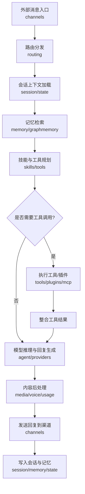

# PinchBot 消息生成流程图

> 说明：该流程描述消息从渠道进入到最终回复发送与记忆回写的主路径，适合作为排障与新成员 onboarding 的参考。

```mermaid
flowchart TD
    A[外部消息入口<br/>channels] --> B[路由分发<br/>routing]
    B --> C[会话上下文加载<br/>session/state]
    C --> D[记忆检索<br/>memory/graphmemory]
    D --> E[技能与工具规划<br/>skills/tools]
    E --> F{是否需要工具调用?}
    F -- 是 --> G[执行工具/插件<br/>tools/plugins/mcp]
    G --> H[整合工具结果]
    F -- 否 --> I[直接进入模型推理]
    H --> I[模型推理与回复生成<br/>agent/providers]
    I --> J[内容后处理<br/>media/voice/usage]
    J --> K[发送回复到渠道<br/>channels]
    K --> L[写入会话与记忆<br/>session/memory/state]
```
