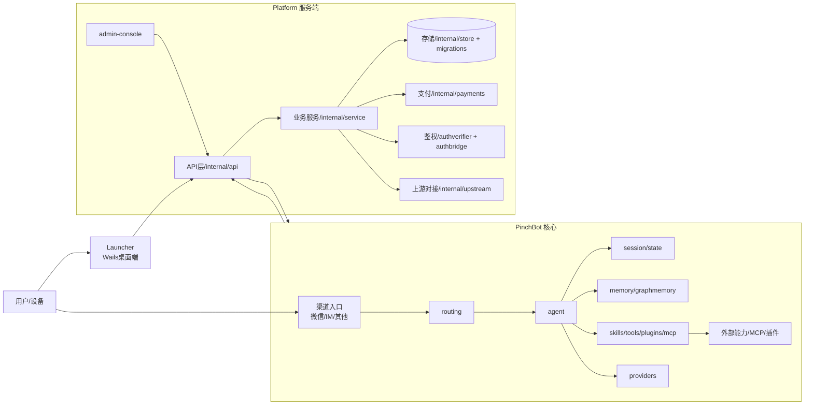

# myagent-bot 产品架构图

> 说明：该图展示 Launcher、PinchBot 与 Platform 的职责边界和主要调用关系，用于架构评审与跨模块协作对齐。

```mermaid
flowchart LR
    U[用户/设备] --> LCH[Launcher<br/>Wails桌面端]
    U --> CCH[渠道入口<br/>微信/IM/其他]

    subgraph PB[PinchBot 核心]
        CCH --> R[routing]
        R --> AG[agent]
        AG --> SE[session/state]
        AG --> MEM[memory/graphmemory]
        AG --> ST[skills/tools/plugins/mcp]
        AG --> PR[providers]
        ST --> EXT[外部能力/MCP/插件]
    end

    subgraph PF[Platform 服务端]
        API[API层/internal/api] --> SVC[业务服务/internal/service]
        SVC --> DB[(存储/internal/store + migrations)]
        SVC --> PAY[支付/internal/payments]
        SVC --> AUTH[鉴权/authverifier + authbridge]
        SVC --> UP[上游对接/internal/upstream]
        ADM[admin-console] --> API
    end

    LCH --> API
    PB --> API
    API --> PB
```
