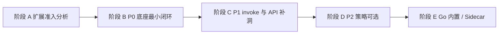

# OpenClaw 扩展适配：可执行开发流程与清单

本文把「生态扩展装上能用」落成**按阶段、可勾选、可验收**的流程；**PinchBot 以 Go 实现、语义尽量与 OpenClaw 对齐**，缺能力时**先扩 PinchBot 底座**；**不默认把扩展迁到 Go**，扩展通过 Node 宿主等路径**能用即可**。细则见 **`.cursor/rules/openclaw-plugin-parity.mdc`**（含文档与代码路径索引）；阶段 E「高频扩展 Go 内置」等为**按需**，非接扩展的必经步骤。

### 已落地（迭代基线）

- **阶段 A 模板**：`docs/extensions/extension-matrix-template.md`（可复制为每扩展矩阵）；`docs/extensions/README.md` 说明与 `PinchBot/extensions/` 的区别；**草稿扫描** `go run ./cmd/scan-extension-matrix -extensions ./extensions`（`PinchBot/cmd/scan-extension-matrix`）。
- **配置片段（S.2）**：`docs/snippets/pinchbot-plugins-gateway.example.json` 与 `docs/snippets/README.md`（`plugins` + `gateway` 合并说明）。
- **Go 工具骨架（S.3）**：`docs/snippets/go-tool-skeleton.md`（`pkg/tools` 的 `Tool` 模板 + 最小测试 + 注册提示）。
- **Manifest**：`openclaw.plugin.json` 要求存在 **configSchema** 且为 JSON object；`plugins.enabled` 中的扩展若校验失败则 **DiscoverEnabled 返回错误**（未启用扩展目录里的坏 manifest 仍跳过）。实现：`PinchBot/pkg/plugins/manifest.go`、`discover.go`；测试：`manifest_test.go`、`discover_test.go`。
- **`POST /tools/invoke`（MVP）**：与 Gateway 同端口；**默认不校验**（`gateway.auth` 未配置或 `mode: none`）；**默认 HTTP deny** 对齐 OpenClaw（`sessions_spawn`、`sessions_send`、`cron`、`gateway`、`whatsapp_login`），可用 `gateway.tools.allow` / `deny` 调整；**可选限流** `gateway.rate_limit.requests_per_minute`（与 **`GET /plugins/status`**、**`POST /plugins/gateway-method`**、**插件 `registerHttpRoute` 路径** 共用计数器；有 `Authorization` 时按 Bearer 凭据分桶，否则按客户端 IP）；超限 **429** + `Retry-After: 60`。`sessionKey` 解析见 `routing.ParseAgentSessionKey`；**`dryRun: true`** 时只做解析与 `action` 合并，**不执行工具**，返回 `ok`、`dryRun`、`result`（说明性 `content`）与 **`resolved`**（`agent_id`、`tool`、`merged_args`、`session_key`、`channel`、`chat_id`）。工具执行走 `ExecuteWithContext`，并设置 `x-openclaw-message-channel` / `x-openclaw-thread-id` 时可覆盖 channel/chat 上下文；成功响应里 `result.content` 优先 `ForUser`，否则回落到 `ForLLM`（兼容 `SilentResult` 类工具）。实现：`PinchBot/pkg/gateway/toolsinvoke/`（含 `ratelimit.go`）；测试：`handler_test.go`、`handler_integration_test.go`、`policy_test.go`；挂载：`pkg/gatewayservice/runtime.go`。
- **配置**：`config.json` → `gateway.auth`（`mode`：`none` / `token` / `password`）、`gateway.tools`（`allow` / `deny`）；**per-agent** `agents.defaults.tools` 与 `agents.list[].tools`（`allow` / `deny` / `alsoAllow`，与 defaults 合并）：**`POST /tools/invoke`** 在 Gateway HTTP deny 之后应用；**主 agent LLM**、**`spawn`/`subagent` 子循环**（`tools.RunToolLoop`）使用同一套合并与拒绝规则（`DeniedByAgentToolsProfile`、`FilterProviderToolDefsByMergedProfile`；子任务 `agent_id` 非空时按目标 agent 解析 profile）。HTTP 专有的默认 deny 不作用于聊天/子循环。见 `pkg/config/config.go`、`pkg/agent/loop.go`、`pkg/tools/toolloop.go`、`pkg/gateway/toolsinvoke/handler.go`。
- **Node 宿主可观测性与隔离**：**`registerHook`** / **`registerChannel`** / **`registerInteractiveHandler`** / **`onConversationBindingResolved`**：**首次调用**仍打 **stderr 警告**（**handler 未执行**）；**`init`** 分别返回 **`registeredHooks`**、**`registeredChannels`**、**`registeredInteractiveHandlers`**、**`conversationBindingResolvedListeners`**（**仅声明**）。**`registerHttpRoute`**：`init` 返回 **`httpRoutes`**；**`registerCommand`** / **`registerService`** / **`registerCli`** / **`registerProvider`** 及 **`registerSpeechProvider`** / **`registerMediaUnderstandingProvider`** / **`registerImageGenerationProvider`** / **`registerWebSearchProvider`**：`init` 返回对应元数据（**`registeredProviders`** 与 **`registeredSpeechProviders`** 等；**仅声明**；**CLI / 服务生命周期 / 各类 provider 推理运行时**与 **hook/channel/interactive/binding 回调**在 PinchBot 侧**未接线**）。**`registerGatewayMethod`**：除 **`init` 元数据**与 **`POST /plugins/gateway-method`**（见上文）外，**完整 OpenClaw `GatewayRequestContext`** 仍见 **C.2.4** 增量。**`GET /plugins/status`** 含 **`http_routes`**、**`cli_commands`**、**`gateway_methods`**、**`registered_services`**、**`register_cli_commands`**、**`registered_providers`**、**`registered_speech_providers`**、**`registered_media_understanding_providers`**、**`registered_image_generation_providers`**、**`registered_web_search_providers`**、**`registered_hooks`**、**`registered_channels`**、**`registered_interactive_handlers`**、**`conversation_binding_resolved_listeners`**。**Gateway** 在启动时按 **默认 agent** 的 Node 快照把 **HTTP** 声明挂到 **共享 mux**（`pkg/gateway/pluginhttp`），请求经 IPC **`httpRoute`** 调用插件 handler；**鉴权 / 限流**与 **`POST /tools/invoke`** 一致（Bearer）。多 agent 仅挂默认 agent；同一路径多插件冲突时 **先注册优先**（日志告警）。**`registerGatewayMethod`**：**`POST /plugins/gateway-method`**（默认 agent、body：`plugin_id` / `pluginId`、`method`、`params`）→ Node IPC **`gatewayMethod`**；**鉴权 / 限流**与 **`/tools/invoke`** 一致；handler 侧提供 **`params` + `respond`** 及最小 **`req`/`context` 桩**（与 OpenClaw 完整 **`GatewayRequestContext`** 同构仍属 **C.2.4** 增量）。实现：`pkg/gateway/plugingatewaymethod/`、`run.mjs` **`handleGatewayMethod`**。  
- **（续）** Node 其余：`api.on('before_tool_call', …)` / **`api.on('after_tool_call', …)`** **已实现**：分别在插件工具 **`execute` 前后**（after 在成功拿到结果之后；after 内异常**不**影响返回给 Go 的工具结果，仅 stderr）。第二参数 ctx 含 **`channel` / `chatId` / `agentId`**（由 Go `NodeHost.Execute` 传入）。其余 OpenClaw **具名 hook** 仍 **不**进入 graph-memory `emit` 并告警。`init` 返回 **`diagnostics`**（`pluginId` / `ok` / `error`）；**单插件 `register` 失败不阻断**其余插件。Go：`NodeHost.Init` 解析 `diagnostics`；`LogPluginInitDiagnostics` 写结构化日志；Node 子进程 **stderr 接到进程 stderr**（便于看到宿主警告）。桥接工具：`before_tool_call` 阻塞错误在 **`ErrorResult` 中去掉 `PINCHBOT_TOOL_BLOCKED:` 前缀**（`bridge.go`）。集成测试：`node_host_integration_test.go`（`TestNodeHost_BeforeToolCall_*`、`TestNodeHost_AfterToolCall_*`）。
- **桥接工具上下文（B.4）**：`NewBridgeTool` 的 `Execute` 收到的 `ctx` 由 **`ToolRegistry.ExecuteWithContext`** 注入 **`WithToolContext`**，与 agent loop、`POST /tools/invoke` 一致；`PluginBridgeExecutor.Execute` 可读取 `tools.ToolChannel` / `ToolChatID`（含取消）。单测：`pkg/plugins/bridge_test.go`。
- **多扩展与部分失败**：仓库内 `extensions/fixture-second` 与 `echo-fixture` 可同批 discover + Node init（`TestNodeHost_TwoBundledFixtures_LoadTogether`）。临时目录三插件（两成功一故意 `register` 抛错）时 **catalog 仅含成功插件的工具**、`diagnostics` 记录失败（`TestNodeHost_ThreePlugins_OneRegisterFails_OthersLoad`）。`AgentInstance.StopPluginHost` 对 nil / 无宿主 **可重复调用**：`pkg/agent/instance_test.go`。

**Node 宿主 `createApi`（`pkg/plugins/assets/run.mjs`）能力一览**

| 状态 | API |
|------|-----|
| 已实现 | `registerTool`、`registerContextEngine`、`pluginConfig`、`config`（Pinchbot 全局，含 `runtime.version` / `runtime.kind`）、`logger`、`runtime`（合并 Go 的 `api.config.runtime`；`runtime.agent.subagent.spawn` 为**显式未实现**桩）、`on(event)`（**非** OpenClaw 具名 hook 时进入 graph-memory 风格 `emit`）、**`api.on('before_tool_call')`** / **`api.on('after_tool_call')`**（见上文「Node 宿主」）、**`resolvePath`**、**`registerHttpRoute`**（**Gateway 转发** + IPC `httpRoute`；见 `pkg/gateway/pluginhttp`）、**`registerCommand`**（**`cli_commands`**；CLI **执行**未接线）、**`registerGatewayMethod`**（**`gateway_methods`** + **`POST /plugins/gateway-method`** → IPC；**`context` 为桩**，见 **C.2.4**）、**`registerService`**（**`registered_services`**；**`start`/`stop` 未调用**）、**`registerCli`**（**`register_cli_commands`**；registrar **未调用**）、**`registerProvider`**（**`registered_providers`**）、**`registerSpeechProvider`**（**`registered_speech_providers`**）、**`registerMediaUnderstandingProvider`**（**`registered_media_understanding_providers`**）、**`registerImageGenerationProvider`**（**`registered_image_generation_providers`**）、**`registerWebSearchProvider`**（**`registered_web_search_providers`**；以上 provider 类均为 **`id`/`label` 元数据**，**运行时未接线**）、**`registerHook`**（**`registered_hooks`**；**hook 不执行**）、**`registerChannel`**（**`registered_channels`**；**channel 未接线**）、**`registerInteractiveHandler`**（**`registered_interactive_handlers`**；**handler 未接线**）、**`onConversationBindingResolved`**（**`conversation_binding_resolved_listeners`**；**回调未接线**） |
| 具名 hook / 未实现（no-op + 首次 stderr 警告） | **`api.on('…')` 的 OpenClaw 具名 typed hook**（不含 `before_tool_call` / `after_tool_call`；见 `run.mjs` 中 `OPENCLAW_TYPED_HOOK_NAMES`）；**不**进入 `registerHook` 元数据。`resolvePath` / `registerHttpRoute` / 上表「已实现」见上行。 |

**`plugins` 重试相关配置（`config.json` → `plugins`）**：`node_host_start_retries`（启动时 spawn+init 次数，默认 3）、`node_host_max_recoveries`（Execute 时进程恢复额外次数，默认 2）、`node_host_restart_delay_ms`（重启退避，默认 500）。

- **每扩展 `pluginConfig`（B.1.2）**：`plugins.plugin_settings` 为按 **manifest id**（大小写不敏感）映射的 JSON 对象，在 discover 之后合并进 `DiscoveredPlugin.PluginConfig`，随 Node `init` 传给 `register(api).pluginConfig`。实现：`pkg/plugins/plugin_settings.go`、`register.go`；测试：`plugin_settings_test.go`、`config_test.go` `TestLoadConfig_PluginSettings`。
- **`GET /plugins/status`（B.2.2）**：与 Gateway 同端口，返回 `node_host`、`plugins_enabled`、`extensions_dir`（默认 agent 工作区解析）、各 agent 的 **init 诊断 + 工具名 + `http_routes` + `cli_commands` + `gateway_methods` + `registered_services` + `register_cli_commands` + `registered_providers` + `registered_speech_providers` + `registered_media_understanding_providers` + `registered_image_generation_providers` + `registered_web_search_providers` + `registered_hooks` + `registered_channels` + `registered_interactive_handlers` + `conversation_binding_resolved_listeners`**（来自 `ManagedPluginHost.InitSnapshot` / `PluginProviderSnapshots` / **`PluginInitExtras`**）；若配置了 **`gateway.rate_limit.requests_per_minute` > 0**，响应含 **`gateway_rate_limit_requests_per_minute`**（与运行时限流一致，便于排障）。**鉴权**：与 **`POST /tools/invoke`**、**`POST /plugins/gateway-method`**、**插件 `registerHttpRoute` 路径** **相同**（`Authorization: Bearer` 规则一致）——若 `gateway.auth.mode` 为 **`token` / `password`**，须带 **`Authorization: Bearer <token|password>`**；`none` 或未配置 auth 时允许匿名（与 `/health` 不同，status 可能暴露插件与工具名，生产务必启用 gateway 鉴权）。实现：`pkg/gateway/pluginsstatus/`；挂载：`gatewayservice/runtime.go`。
- **`api.runtime`（C.2.2）**：Go `BuildPinchbotPluginAPIConfig` 注入 `config.runtime`；`run.mjs` 合并为 `api.runtime`（`version` / `kind` / `agent.subagent.spawn` 桩）。测试：`pinchbot_config_test.go`。

**安全（D.4 摘要）**：`POST /tools/invoke`、**`POST /plugins/gateway-method`** 与 **`GET /plugins/status`** 在 **`gateway.auth.mode` 为 `none` 或未配置**且 Gateway 对局域网/公网暴露时，可能等同**匿名访问**（工具执行、**插件 Gateway RPC** 与插件状态泄露）；生产环境应配置 **`token` 或 `password`** 并配合防火墙；详见 `pkg/gateway/toolsinvoke`、`pkg/gateway/plugingatewaymethod`、`pkg/gateway/pluginsstatus` 与 `GatewayConfig`。

**扩展与 agent 的关系（B.1.3 摘要）**

- `plugins.enabled`：列出要加载的扩展 **manifest id**（如 `lobster`、`echo-fixture`）。`graph-memory` 在 Node 宿主侧会跳过（Go 原生）。  
- `plugins.extensions_dir`：相对路径时优先 `<workspace>/extensions`，否则可落在可执行文件旁（发布布局）。  
- `plugins.node_host`：为 `true` 时由 `RegisterNodeHostTools` 拉起 Node 宿主并注册桥接工具；与 `agents.list` 独立——**每个 agent 实例**各自一次 Node 宿主（多 agent 即多进程，需注意资源）。HTTP **`/tools/invoke`**：先 `gateway.tools`，再 **`agents.defaults.tools` / `agents.list[].tools`**（与内置 `tools.*` 的 `enabled` 是不同层）。

---

## 0. 角色与输入

| 角色 | 责任 |
|------|------|
| 产品/负责人 | 每个阶段划定范围、批准 sidecar/真同构投入 |
| 开发 | 按清单改 `PinchBot/` 底座与文档 |
| 测试 | 每阶段验收用例 |

**常驻输入**

- 目标扩展目录：`PinchBot/extensions/<id>/` 或用户配置的 `extensions` 根。
- 上游对照：`openclaw-main` 中 `docs/dev/extension-execution-flow.zh-CN.md`、`docs/gateway/tools-invoke-http-api.md`、扩展内 `openclaw.plugin.json` 与 `index.ts` 的 `register(api)`。

---

## 1. 总流程（鸟瞰）

1. **阶段 A**：每个扩展一份「能力矩阵」→ 决定本迭代做宿主补洞 / invoke / sidecar / 延期。  
2. **阶段 B**：发现、校验、诊断、宿主生命周期、工具上下文一致。  
3. **阶段 C**：`POST /tools/invoke`（可先窄实现）+ 按矩阵补 `OpenClawPluginApi` / runtime。  
4. **阶段 D**（可选）：per-agent tools、group policy、hook 与 OpenClaw 配置同行为。  
5. **阶段 E**：高频扩展 Go 化；重扩展评估 sidecar 全功能 OpenClaw。

---

## 2. 阶段 A — 扩展准入分析（每个扩展必做）

### A.1 清单模板（复制为 `docs/extensions/<id>-matrix.md` 或 issue 正文）

**可复制模板**：[`docs/extensions/extension-matrix-template.md`](extensions/extension-matrix-template.md)。

- [ ] **A.1.1** 读取 `openclaw.plugin.json`：记录 `id`、channels、providers、`configSchema` 摘要。  
- [ ] **A.1.2** 通读 `register(api)`（及 setup 入口若存在）：列出实际调用的 API：

  - `registerTool` / `registerHook` / `registerChannel` / `registerHttpRoute` / `registerGatewayMethod` / `registerCli` / `registerService` / `registerProvider*` / `registerContextEngine` / `registerCommand` / `on` / `onConversationBindingResolved` / 其它。

- [ ] **A.1.3** 记录对外部依赖：二进制（如 `lobster`）、环境变量、HTTP 回调（如 `openclaw.invoke` → `/tools/invoke`）、子代理、会话形态。  
- [ ] **A.1.4** 判定路线（选一或组合）：

  | 路线 | 条件 |
  |------|------|
  | **宿主 + shim** | 仅工具 + 已有/可补 shim |
  | **补底座** | 缺某一平台能力但值得在 PinchBot 内做 |
  | **窄 invoke** | 依赖 Lobster / HTTP 工具链 |
  | **Sidecar OpenClaw** | 大量 `registerChannel` 等短期无法在 Go 对齐 |
  | **暂不启用** | 风险或未覆盖能力 |

- [ ] **A.1.5** 定义**验收用例**：至少 1 条 happy path + 1 条失败路径（配置缺失、沙箱、鉴权）。

### A.2 与现有 PinchBot 能力快速对照

- Node 宿主入口：`PinchBot/pkg/plugins/assets/run.mjs`（`createApi` 已实现子集）。  
- Go 侧注册与生命周期：`PinchBot/pkg/plugins/register.go`、`ManagedPluginHost` 相关。  
- 发现：`PinchBot/pkg/plugins/discover.go`（`id` + **configSchema** 为合法 JSON object；`plugins.enabled` 中某项 manifest 非法时 **整次 DiscoverEnabled 报错**，未启用的坏 manifest 目录会跳过）。

---

## 3. 阶段 B — P0 底座最小闭环（可并行多项）

### B.1 Manifest 与配置

- [x] **B.1.1** 解析并校验 `configSchema`：**缺失或非法时拒绝加载**（与 OpenClaw 行为对齐；可为「仅要求存在合法 JSON Schema 对象」起步）。  
- [x] **B.1.2** 插件级配置注入：确保 `pluginConfig` 来自 PinchBot 配置块且传入 Node `register(api).pluginConfig`。  
- [x] **B.1.3** 文档：在 `README` 或 `docs/` 说明 `plugins.enabled`、`extensions` 路径、与 `agents`/工具 allow 的关系。

**涉及文件（按需改）**：`pkg/plugins/discover.go`、`pkg/config`（`PluginsConfig`）、`pkg/plugins/register.go` / `assets/run.mjs`。

### B.2 加载诊断（可观测）

- [x] **B.2.1** 加载成功/失败写入结构化日志（插件 id、原因：manifest、依赖、register 抛错）。  
- [x] **B.2.2** （可选）HTTP 或 CLI 子命令输出「已加载扩展列表 + 状态」，便于支持排障。

### B.3 Node 宿主健壮性

- [x] **B.3.1** 多插件：**单插件 `register` 失败不导致整进程不可用**（记录 diagnostic，其余继续）。  
- [x] **B.3.2** Gateway 停止时：**可靠关闭** Node 宿主 — `AgentRegistry.StopPluginHosts` → 各 `AgentInstance.StopPluginHost`（`sync.Once` 关闭一次）；无宿主时 **可重复调用**（`instance_test.go`）。  
- [x] **B.3.3** 重试/backoff 与配置项文档化（`NodeHostStartRetries` 等）— 见上文「已落地」配置表与 `pkg/config/config.go` `PluginsConfig`。

### B.4 工具上下文与主 loop 一致

- [x] **B.4.1** 从插件经 IPC 执行工具时，使用与 `pkg/tools/registry.go` 一致的 **`WithToolContext`**（channel/chatID；无则约定空串或 `http-invoke` 等可审计值）。  
- [x] **B.4.2** 补充测试：同工具在「消息路径」与「桥接路径」行为一致（至少一条集成或单测）——见 `bridge_test.go`（registry 注入一致；invoke 风格与 agent 风格各一条 `ExecuteWithContext` 断言）。

### B.5 阶段 B 验收

- [x] 至少 **2 个扩展**（`echo-fixture` + `fixture-second`）可同时 discover + Node init；**单插件 `register` 抛错**时其余插件仍加载（集成测试：`TestNodeHost_*`）。*说明：manifest 在 **`plugins.enabled` 内**仍非法时 **整次 discover 失败**（设计如此）；「坏 manifest 不拖死」指**未启用**目录或 **Node 内**单插件失败。  
- [x] 文档中写明当前 **shim 已实现的 API 列表**（与 `run.mjs` 同步维护）— 见「已落地」表格。

---

## 4. 阶段 C — P1：`/tools/invoke` 与 API 补洞

### C.1 `POST /tools/invoke`（建议分两步交付）

**C.1 窄实现（MVP）**

- [x] **C.1.1** 在 Gateway mux 注册 `POST /tools/invoke`（与 `pkg/gatewayservice/runtime.go` 中 `RegisterHandler` 模式一致）。  
- [x] **C.1.2** 请求体：`tool`、`action`、`args`、`sessionKey`、`dryRun`；**body 上限 2MB**。  
- [x] **C.1.3** **Gateway 鉴权**：扩展 `GatewayConfig`（`auth.mode` / token / password）；`Authorization: Bearer`；失败 401；**可选限流** `gateway.rate_limit.requests_per_minute` → 429（与 **`GET /plugins/status`**、**`POST /plugins/gateway-method`**、**插件 HTTP**（`pluginhttp`）共用）。  
- [x] **C.1.4** **HTTP 默认 deny 列表**（对齐 OpenClaw：`sessions_spawn`、`sessions_send`、`cron`、`gateway`、`whatsapp_login` 等）+ 配置 `gateway.tools.deny` / `allow` 微调。  
- [x] **C.1.5** `sessionKey` → `agentId`：使用 `pkg/routing` 中 `ParseAgentSessionKey` 等；缺省/`main` 映射到默认主会话（与 OpenClaw 文档语义对齐）。  
- [x] **C.1.6** 从对应 `AgentInstance.Tools` 取工具并 `Execute`；`action` 合并规则对齐 OpenClaw（schema 含 `action` 时并入 `args`）。  
- [x] **C.1.7** 响应码：200 / 400 / 401 / 404 / 405 / 429 / 500 与 OpenClaw 文档一致；404 统一「Tool not available」。  
- [x] **C.1.8** 测试：鉴权失败、未知工具、deny 列表内工具、成功执行（可对齐上游测试意图）。

**C.2 策略加深（可选迭代）**

- [x] per-agent `tools.allow/deny/alsoAllow` + `agents.defaults.tools` 合并，用于 **`POST /tools/invoke`** 与 **主 agent LLM**（`MergeAgentToolsProfile`、`ResolvedAgentToolsProfile`、`DeniedByAgentToolsProfile`、`FilterProviderToolDefsByAgentProfile`；单测见 `policy_test.go`、`handler_integration_test.go`、`agent_tools_profile_test.go`）。  
- [x] **Go**：`ToolRegistry.SetBeforeToolCall` / `BeforeToolCallHook`（`pkg/tools`，执行前可拒绝或改写 `args`；单测 `TestToolRegistry_BeforeToolCall_*`）。**设计**见 `docs/openclaw-before-tool-call-design.md`。  
- [x] **Node（桥接 execute）**：`run.mjs` 在插件工具 `execute` 前调用已注册的 `before_tool_call`；Go 传入 channel/chat/agent。**与 OpenClaw 上游字段完全一致的 payload** 仍属 **P2** 对照项。  
- [ ] group policy（多群风控需求出现时再做）。

**新建模块建议**：`pkg/gateway/toolsinvoke/`（handler + auth + deny + body 解析），避免 `channels` 包职责膨胀。

### C.2 Shim / `OpenClawPluginApi` 按需补全

- [x] **C.2.1** 根据阶段 A 矩阵，按优先级实现或 stub（明确日志「未实现」）：**`registerHook`** / **`registerChannel`** / **`registerInteractiveHandler`** / **`onConversationBindingResolved`**：`run.mjs` **no-op + stderr** + **init 元数据**（**`PluginInitExtras`**）+ **`/plugins/status`** 对应字段（**运行时仍**未接线）；**`registerHttpRoute`**：init **`httpRoutes`** + Gateway **`pluginhttp`** + IPC **`httpRoute`**；**`registerGatewayMethod`**：init 元数据 + **`POST /plugins/gateway-method`**（**C.2.4**）；**`registerCommand`** / **`registerService`** / **`registerCli`** / **`registerProvider`** / **`registerSpeechProvider`** 等：init 元数据 + **`/plugins/status`** 字段（**CLI 执行 / provider 推理 / `start`·`stop`** 仍属后续）。见「已落地」表。  
- [x] **C.2.2** `api.runtime`：对需要 `subagent` / 版本的扩展逐步补字段或委托 Go（避免静默 `undefined` 导致难查 bug）。  
- [x] **C.2.3** 每补一项 API：**至少一条测试**或文档用例（`runtime`：`pinchbot_config_test.go`）。

### C.2.4 Gateway RPC（`registerGatewayMethod`）

**已落地（PinchBot MVP）**

- Node：**`handleGatewayMethod`** IPC；`registerGatewayMethod` 时登记 **`globalGatewayMethodHandlers`**（`pluginId` + `method`）；handler 可 **`ctx.respond(...)`** 或 **return 值**（后者作为 `payload`）。
- Go：**`NodeHost.GatewayMethod`** / **`ManagedPluginHost.GatewayMethod`**。
- Gateway：**`POST /plugins/gateway-method`**，JSON：`plugin_id`（或 `pluginId`）、`method`、`params`；响应 **`{ "ok": true, "result": <Node 返回对象> }`**；**鉴权 / 限流**与 **`POST /tools/invoke`**、`pluginhttp` **对齐**；**仅默认 agent** 的 Node 宿主（与 `pluginhttp` 一致）。实现：`pkg/gateway/plugingatewaymethod/`。

可复制 **`curl`**（替换 Gateway 地址与 token、**`plugin_id`** 为扩展 manifest id）：**`docs/snippets/README.md`** 中 **「示例：`POST /plugins/gateway-method`」**。

**仍属增量 / 按需排期（与上游 OpenClaw 完全同构）**

- 向 handler 注入完整 **`GatewayRequestContext`**（deps、cron、broadcast 等），而非当前最小桩；
- 与 OpenClaw **WebSocket / RequestFrame** 同一套协议与路由（若产品要求字节级兼容）。

### C.3 阶段 C 验收

- [x] Lobster 文档中的 **`openclaw.invoke` 场景**：在 PinchBot 上有一条可重复执行的验证步骤（含 Gateway 地址与 token）— 见 `docs/pinchbot-lobster-from-openclaw-flow.md` §「`openclaw.invoke` 对照验证（PinchBot）」。  
- [x] **矩阵 / 迭代范围**：本仓库已落地的 OpenClaw 插件底座（manifest、Node 宿主、桥接、`/tools/invoke`、`plugins/status`、**`POST /plugins/gateway-method`（registerGatewayMethod）**、`plugin_settings`、`runtime`、**per-agent tools 过滤（invoke + 主 loop LLM）**、**Go / Node `before_tool_call`（见上文）** 等）见上文「已落地」与阶段 B/C 勾选。**刻意延期**（待产品按需排期）：**C.2.4** 增量（完整 **`GatewayRequestContext`** / 上游 WS 协议同构）、`before_tool_call` 与 OpenClaw 上游 **payload 字段级**完全同构、group policy、与 OpenClaw 完全一致的 profile 命名/顺序规格（D.1/D.2 深度对齐）、D.3、E/S 节若干项。

---

## 5. 阶段 D — P2：配置与 OpenClaw 行为对齐（按需）

仅当产品承诺「迁移 OpenClaw 配置」或「多群工具策略」时启用。

- [ ] **D.1** 运行时 `config` 结构与 OpenClaw 关键字段对齐（`tools`、`agents.list[].tools`、`gateway`、`session`）；**字段速查（草案）**见 `docs/openclaw-config-parity-d1-sketch.md`。  
- [x] **D.2**（基线）主路径上 **`agents.*.tools` 与 invoke 共用**合并与拒绝规则（`DeniedByAgentToolsProfile`、LLM `FilterProviderToolDefsByAgentProfile` + 执行前硬拒绝）。与 OpenClaw 全量顺序/命名 parity、fixture 黄金 JSON 对比仍可选。  
- [ ] **D.3** Group policy：在 `RouteInput` / session 已有信息上挂工具策略（按渠道实现 `resolveToolPolicy` 钩子）。  
- [x] **D.4** 安全审计：文档说明 **`/tools/invoke`**、**`/plugins/gateway-method`** 与 **`auth.mode=none`** 的风险（对齐 OpenClaw 安全叙事）— 见上文「已落地」安全摘要（**`GET /plugins/status`** 等同理）。

---

## 6. 阶段 E — Go 内置与 Sidecar

### E.1 Go 内置（单个扩展）

- [ ] **E.1.1** 冻结 TS 版行为：测试或录制的输入输出作为黄金样例。  
- [ ] **E.1.2** 在 `pkg/tools` 或 `pkg/...` 实现等价逻辑；配置键名与错误语义对齐。  
- [ ] **E.1.3** `plugins.enabled` 与「仅 Go / 禁用 Node 同名」策略（如 `nativeGoPluginExclusiveNodeIDs` 模式）。  
- [ ] **E.1.4** 文档与发布说明：依赖、平台差异（Windows/macOS）。

### E.2 Sidecar（全功能 OpenClaw）

- [ ] **E.2.1** 部署与版本策略（与 PinchBot 同机 / 固定端口 / 健康检查）。  
- [ ] **E.2.2** 安全边界：谁持有 token、网络暴露面。  
- [ ] **E.2.3** 用户文档：何时用 sidecar、何时用内置宿主。

---

## 7. 可选：SKILL / 内部流水线

不替代底座实现，用于提速准入分析。

- [x] **S.1** 能力矩阵 **文档模板**（`docs/extensions/extension-matrix-template.md`）；**草稿扫描器** `PinchBot/cmd/scan-extension-matrix`（`go run ./cmd/scan-extension-matrix -extensions ./extensions`，见 `docs/extensions/README.md`）。  
- [x] **S.2** PinchBot 配置片段：**`docs/snippets/pinchbot-plugins-gateway.example.json`** + **`docs/snippets/README.md`**（合并方式、`plugin_settings`、gateway 鉴权与 `tools` deny/allow、与内置 `tools.*` 的关系）。  
- [x] **S.3** Go 化骨架：**`docs/snippets/go-tool-skeleton.md`**（可复制 `.go` / `_test.go` 块；接线见 `NewAgentInstance` 与 `ToolsConfig`）。自动化 **代码生成脚本**仍可选。

---

## 8. 执行顺序建议（单迭代排期示例）

| 周次 | 交付 |
|------|------|
| 1 | 阶段 A 模板定稿 + 1 个真实扩展矩阵；B.1 manifest 校验 + B.2 诊断 |
| 2 | B.3/B.4 多插件与上下文；第二扩展 fixture |
| 3 | C.1 `/tools/invoke` MVP + 测试 |
| 4 | C.2 按矩阵补 1～2 个 API；文档更新 |
| 后续 | D/E 按产品优先级插入 |

---

## 9. 完成定义（Definition of Done）

- [x] 本迭代扩展在「干净配置」下可按文档完成 happy path（`openclaw-extension-adapter-runbook`、`pinchbot-lobster-from-openclaw-flow` 等）。  
- [x] 失败路径有明确日志或 HTTP 错误类型（插件 init diagnostics、Node stderr、tools/invoke JSON 错误体）。  
- [x] `docs/` 与当前 shim/API 一致（见「已落地」表与 `run.mjs`）。  
- [x] 回归：`go test ./...`（PinchBot）覆盖插件、toolsinvoke、gatewayservice 等；发布路径仍按 release runbook。

---

## 10. 参考路径（仓库内）

| 主题 | 路径 |
|------|------|
| Parity 规则 | `.cursor/rules/openclaw-plugin-parity.mdc` |
| Lobster 对照流程 | `docs/pinchbot-lobster-from-openclaw-flow.md` |
| `before_tool_call` 设计草案 | `docs/openclaw-before-tool-call-design.md` |
| D.1 配置对齐速查（草案） | `docs/openclaw-config-parity-d1-sketch.md` |
| 插件注册与 Node 宿主 | `PinchBot/pkg/plugins/register.go`、`assets/run.mjs` |
| 扩展发现 | `PinchBot/pkg/plugins/discover.go` |
| Gateway HTTP 挂载 | `PinchBot/pkg/gatewayservice/runtime.go` |
| 插件状态 HTTP | `PinchBot/pkg/gateway/pluginsstatus/`（`GET /plugins/status`） |
| 插件 Gateway RPC（registerGatewayMethod） | `PinchBot/pkg/gateway/plugingatewaymethod/`（`POST /plugins/gateway-method`） |
| 扩展能力矩阵模板 / 草稿扫描 | `docs/extensions/extension-matrix-template.md`、`PinchBot/cmd/scan-extension-matrix` |
| 插件 + Gateway 配置片段 | `docs/snippets/pinchbot-plugins-gateway.example.json`、`docs/snippets/README.md`（含 **`POST /plugins/gateway-method`** `curl` 示例） |
| Go 原生工具骨架（S.3） | `docs/snippets/go-tool-skeleton.md` |
| 多 agent 与路由 | `PinchBot/pkg/agent/registry.go`、`pkg/agent/loop.go`、`pkg/routing/` |
| OpenClaw 配置迁移类型（参考） | `PinchBot/pkg/migrate/sources/openclaw/openclaw_config.go` |

---

## 11. 人工测试清单（启动联调）

以下项需在**本机启动 PinchBot 网关**（及按需 **Launcher**）后，由人工按顺序或按需执行；**通过标准**为现象与「预期」一致，并可在后续迭代中逐项与你方对齐结论。自动化回归仍以 `go test` 与已有集成为准。

### 11.1 前置

| # | 测试项 | 预期 / 备注 |
|---|--------|-------------|
| 11.1.1 | 使用当前迭代构建的 **`picoclaw`/`pinchbot`**（及按需 **`launcher-chat`**），配置指向有效 **`config.json`** 与工作区 | 无启动即崩溃；日志无 Discover 整批失败（若 `plugins.enabled` 内 manifest 非法则属设计上的硬失败） |
| 11.1.2 | `plugins.node_host: true`，`plugins.enabled` 含目标扩展（如 **`lobster`**）及 **`extensions`/`extensions_dir` 可解析** | Node 宿主进程可拉起；stderr 无持续性致命错误 |

### 11.2 网关与健康

| # | 测试项 | 预期 / 备注 |
|---|--------|-------------|
| 11.2.1 | `GET http://<gateway-host>:<port>/health`（及若文档另有 **`/ready`**） | **200**； body 与发布说明一致 |
| 11.2.2 | 记录实际 **Gateway 端口**（默认常为 `18790`，以配置为准） | 后续 curl 与 Launcher **`gatewayURL`** 一致 |

### 11.3 Launcher 聊天（若使用桌面小窗）

| # | 测试项 | 预期 / 备注 |
|---|--------|-------------|
| 11.3.1 | 登录后发送一条普通消息 | 有回复；日志中 **`channel=launcher`** |
| 11.3.2 | 请求 Agent 用 **`exec`** 执行：`echo PINCHBOT_EXEC_OK && uname -sr && pwd` | 输出含 **`PINCHBOT_EXEC_OK`**；无 `exec is restricted to internal channels`（`tools.exec.allow_remote` 与 **`launcher` 信任通道** 已按当前策略配置） |

### 11.4 `GET /plugins/status`

| # | 测试项 | 预期 / 备注 |
|---|--------|-------------|
| 11.4.1 | 无鉴权或 `gateway.auth.mode: none` 时访问（与当前环境一致） | **200**；含 **`node_host`**、**`plugins_enabled`**、各插件 **diagnostics**、工具名列表 |
| 11.4.2 | 若配置了 **`gateway.auth`**（token/password） | 无 Bearer 时 **401**；带正确 **`Authorization: Bearer …`** 时 **200** |
| 11.4.3 | 若配置了 **`gateway.rate_limit.requests_per_minute`** | 响应体含 **`gateway_rate_limit_requests_per_minute`**；超限行为符合设计（**429**） |

### 11.5 `POST /tools/invoke`

| # | 测试项 | 预期 / 备注 |
|---|--------|-------------|
| 11.5.1 | **`dryRun: true`**：合法 `tool`/`sessionKey`，不执行真实副作用 | **200**；`dryRun: true`，含 **`resolved`**（`agent_id`、`tool`、`merged_args` 等） |
| 11.5.2 | 对**允许**的工具执行一次真实 invoke（与 per-agent **`tools` profile** 一致） | **200**，`result` 与工具语义一致 |
| 11.5.3 | 请求 **HTTP deny 列表**内工具（如文档所列 `sessions_spawn` 等） | **403** 或与实现一致的拒绝，**非** silent 成功 |
| 11.5.4 | per-agent **`tools.deny`** 含某工具时 | 对该 agent 的 invoke **拒绝**（与 `DeniedByAgentToolsProfile` 行为一致） |

### 11.6 `POST /plugins/gateway-method`（`registerGatewayMethod`）

| # | 测试项 | 预期 / 备注 |
|---|--------|-------------|
| 11.6.1 | 使用 **`docs/snippets/README.md`** 中示例 **`curl`**（替换 base URL、token、**`plugin_id`**） | **200**，`ok: true`，`result` 为 Node 返回结构（若扩展未实现该方法则为预期错误体） |
| 11.6.2 | 鉴权与 **`/tools/invoke`** 一致 | 无 token 时与当前 **`gateway.auth`** 配置一致 |

### 11.7 插件 HTTP 路由（`registerHttpRoute` / `pluginhttp`）

| # | 测试项 | 预期 / 备注 |
|---|--------|-------------|
| 11.7.1 | 若扩展注册了 HTTP 路由：对声明路径发 **GET/POST**（与扩展文档一致） | 路由命中插件 IPC；**401/429** 行为与 Gateway 策略一致 |
| 11.7.2 | 同路径多插件冲突 | 先注册优先（日志告警），行为符合 `pluginhttp` 设计 |

### 11.8 Lobster / `openclaw.invoke` 对照（目标扩展）

| # | 测试项 | 预期 / 备注 |
|---|--------|-------------|
| 11.8.1 | 按 **`docs/pinchbot-lobster-from-openclaw-flow.md`** 完成 **invoke / 工作流** 对照步骤 | Happy path 可重复；失败时有明确日志（含 Node stderr、脚本错误） |
| 11.8.2 | 工作流或辅助脚本在 **`"type": "module"`** 下避免 **`require`** 与 ESM 混用 | 无 `ReferenceError: require is not defined`；若仍出现则属扩展脚本/生成逻辑缺陷 |

### 11.9 Node 桥接钩子（可选）

| # | 测试项 | 预期 / 备注 |
|---|--------|-------------|
| 11.9.1 | 扩展注册 **`before_tool_call` / `after_tool_call`** 时，触发桥接工具 | 日志与行为符合 `run.mjs` / `NodeHost` 实现（after 内异常不影响工具结果） |

### 11.10 失败路径与回归

| # | 测试项 | 预期 / 备注 |
|---|--------|-------------|
| 11.10.1 | **单插件** `register` 抛错、其余插件仍应加载 | 与集成测试意图一致；**`GET /plugins/status`** 中 diagnostics 可见失败插件 |
| 11.10.2 | Gateway **停止**再启动 | Node 宿主无僵尸进程；重复 **`StopPluginHost`** 不崩溃 |

---

维护：本清单随迭代勾选更新；重大架构变更（如默认 sidecar）时修订 §1 与 §6；**§11** 随联调范围增减测试项。
